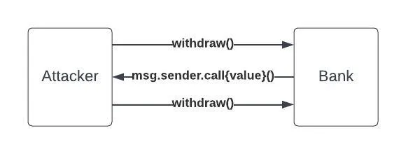

# Re-entrancy Attack

Reentrancy is a state synchronization problem. When an external call is made to another smart contract, execution flow control is transferred. The calling contract has to make sure all globally shared state is fully synchronized before transferring control. Since the EVM is a single threaded machine, if a function does not fully synchronize state before transferring execution control, the function can be reentered with the same state as if it were being called for the first time. This can cause the function to execute actions repeatedly which were only intended to be executed once.



```solidity
mapping (address => uint) public balanceOf;

function deposit() public payable {
     balanceOf[msg.sender] += msg.value;
     Deposit(msg.sender, msg.value);
}

function withdraw(uint amount) public {
     require(balanceOf[msg.sender] >= amount);
     msg.sender.call{value: amount}("");    //re-entrancy (transfer ether before balance updation)
     balanceOf[msg.sender] -= amount;
     Withdrawal(msg.sender, amount);
}
```

### What can trigger reentrancy?

Any external call can lead to reentrancy if the proper CEI patterns are not being followed. Slither is an open source static analysis framework which can help auditors and bug hunters find potential entry points for reentrancy vulnerabilities. However, the following standards are a few examples of ways execution flow may be transferred to an arbitrary contract:

- Low level calls `(.call())`
- `transfer` of ERC223 tokens
- `transferAndCall` of ERC667 tokens
- `transfer` of ERC777 tokens
- `safe\*` transfer functions of ERC1155 tokens
- `\*AndCall` functions of ERC1363 tokens
- `safe\*` functions such as `safeTransfer` or safeMint of ERC721 tokens
- `transfer` of certain ERC20 tokens which may have implemented a custom callback function for receivers

### Types of Reentrancy

- [Single function Reentrancy](https://medium.com/valixconsulting/solidity-smart-contract-security-by-example-02-reentrancy-b0c08cfcd555)
- [cross function Reentrancy](https://medium.com/valixconsulting/solidity-smart-contract-security-by-example-04-cross-function-reentrancy-de9cbce0558e)
- [cross contract Reentrancy](https://medium.com/valixconsulting/solidity-smart-contract-security-by-example-05-cross-contract-reentrancy-30f29e2a01b9)
- [cross chain Reentrancy]()
- [Reentrancy via Modifier](https://medium.com/valixconsulting/solidity-smart-contract-security-by-example-03-reentrancy-via-modifier-fba6b1d8ff81)
- [Read Only Reentrancy](https://medium.com/@zokyo.io/read-only-reentrancy-attacks-understanding-the-threat-to-your-smart-contracts-99444c0a7334)

### Referance

https://medium.com/immunefi/the-ultimate-guide-to-reentrancy-19526f105ac
